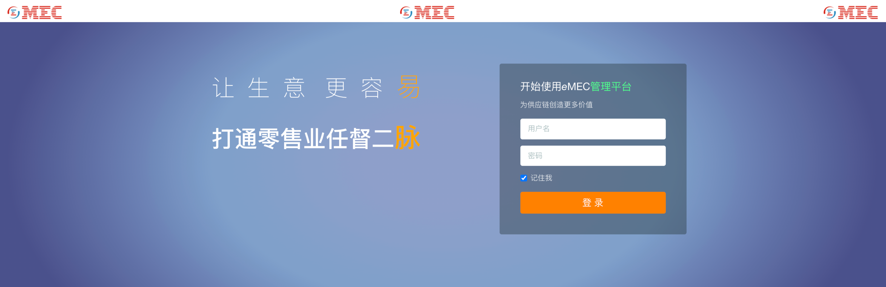
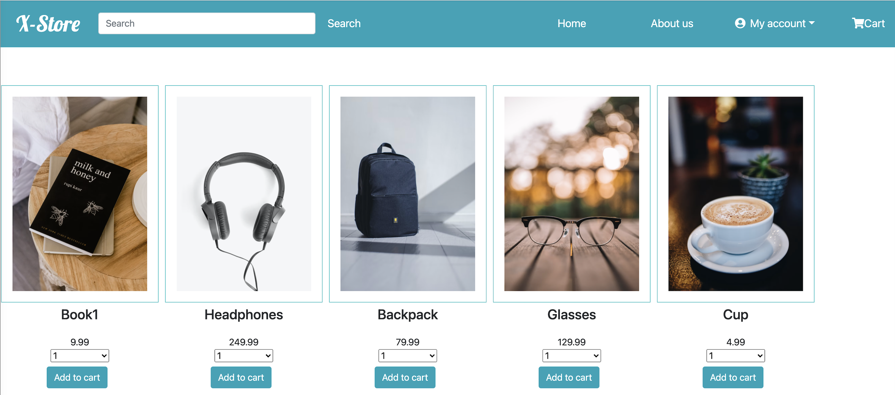

# Summary

As a full stack software engineer, I always believe my ultimate goal is to make a perfect product. Sometimes, it's like a dream that's not something we can achieve in the short term, but we will keep pursuing it in my life. 

I love technologies. I love the world. No matter where I am, in my hometown of China or relocated in the US，I hope to use technologies to make the world a little bit better. No matter how my life evolves, this mission remains constant.

# My Projects

### :black_circle: Student Performance Analysis System 

See [project details](./xroster.md), [demo](http://34.123.176.202:8080)

---

### :black_circle: STEM Recruiting System

See [project details](./xstem.md), [demo](http://34.123.176.202:8081)

---

### :black_circle: Elastic Mobile E-Commerce Platform

See [project details](./emec.md), [demo](https://34.123.176.202:3001)

---

### :black_circle: Movie Search Engine

See [project details](./ximdb.md), [demo](http://35.225.43.107:5000)

---

### :black_circle: Online Grocery Store

See [project details](./xstore.md), [demo](http://35.225.43.107:4200)

---
